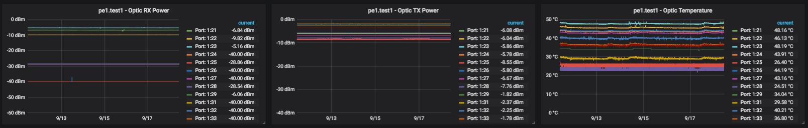

# extreme-optics-influxdb
This is an EXOS Compatible Python script to gather and export SFP statistics to InfluxDB over HTTPS.

This script gets installed onto a device (via SCP etc.) running Extreme EXOS 16 (tested on 16.1.4.2 so YMMV) and can be run periodically to collect, parse and push optical interface statistics to an InfluxDB instance.


#### Run Script Manually
To run the script manually:
```
run script extreme_optics_influxdb.py <device_name> <influxdb_host> <influxdb_username> <influxdb_password> <influxdb_database> --vr 2 --influxdb_port 
```
**Parametres:**
- Device Hostname to be used as the InfluxDB `hostname` tag.
- InfluxDB IP Address, service should be listening on port `8086`
- InfluxDB Username
- InfluxDB Password
- InfluxDB Database name
- Optionally: pass the VR number (Mgmt is VR 2, default is VR 1) if you're not running the management network out of the default VR.
- Optionally: pass the influxdb port number if it's different to the standard TCP 8086 port.

#### Run Script Periodically
Create a Universal Port Manager (UPM) profile:
```
create upm profile optic_metrics_to_influxdb
```
This will prompt you to enter the contents of the profile followed by a `.` on a blank line.
Enter the above `run script extreme_optics_influxdb.py ...` line, followed by a blank line with a `.`.

Create a timer and associate to the profile:
```
create upm timer timer_1m
configure upm timer timer_1m profile optic_metrics_to_influxdb
configure upm timer timer_1m after 10 every 60
```

This should now wait 10 seconds, run the script and then repeat every 60 seconds following.



*This is a sample of the metrics displayed in Grafana:*